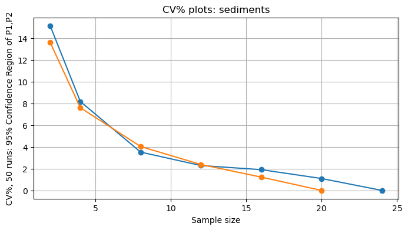

# PySASF
**A Python package for Source Apportionment with Sediment Fingerprinting.**

PySASF was developed to provide computational resources for research aimed at identifying the contributions of various sources to fluvial sediments. More specifically, PySASF implements methods for calculating the proportions contributed by each source from a dataset and its random subsamples, as well as analyzing solution variabilities. Additionally, it includes routines for visualizing confidence regions and other plots from the complete dataset and reduced samples.

This initiative originated from a collaboration between the Department of Soil Science and the Department of Mathematics at the Federal University of Santa Maria ([UFSM](https://www.ufsm.br/)), with participation from other educational and research institutions. The initial motivation was to reproduce the results published in [Clarke and Minella (2016)](https://onlinelibrary.wiley.com/doi/abs/10.1002/hyp.10866) and to create a package of Python routines to facilitate the replication of the experiment with other data sources.

PySASF has been used and tested first by the Interdisciplinary Research Group on Erosion and Surface Hydrology ([GIPEHS](https://www.instagram.com/gipehs.ufsm/) at UFSM. New analysis models, resulting from research and development efforts, will be incorporated in the future, based on this academic collaboration.

## Install

Download the package from [here](https://github.com/tiagoburiol/PySASF/blob/main/dist/pysasf-0.0.5.tar.gz) 
and install it using the following command line in the directory where the file was downloaded.

```python
$ pip3  install pysasf-0.0.5.tar.gz
```

You can download a Python script for testing from [here](https://github.com/tiagoburiol/PySASF/blob/main/tests/cm.py). You need to download the data () file from  [here](https://github.com/tiagoburiol/PySASF/blob/main/data/arvorezinha_database.xlsx) and store it in a folder named `data` in the same directory as the script. Then you can run it using the terminal command:

```python
$ python3 cm.py
```

This script run a command terminal version of the example of usage 
 [quick start](https://github.com/tiagoburiol/PySASF/blob/main/notebooks/quick_start.ipynb) notebook.


Alternatively you can download the full project sources [here](https://github.com/tiagoburiol/PySASF/archive/refs/heads/main.zip), unzip and go to notebooks directory. Open `quick_star.ipynb` using [Jupyter Notebook](https://jupyter.org/) or [Jupyter Lab](https://jupyter.org/).

If you receive a `No module named 'pysasf'` error message, try including the following lines in the beginning of your notebook:

```python
import sys
sys.path.append('/your_path_to/PySASF-main')
```

Replace `your_path_to` with the path to the directory where PySASF-main was extracted.


You will needs [NumPy](https://numpy.org/), [Scipy](https://scipy.org/), [MatplotLib](https://matplotlib.org/) and [Pandas](https://pandas.pydata.org/)  instaled. All dependencies can be satisfied by an [Anaconda](https://anaconda.org/) installation.

## Example of usage
### 1. Loading the data

A good starting point is to import the `BasinData` object class to store data from a basin's sediment sources. An instance of BasinData should be created, and the data should be loaded from a file. It is common to store data files in the 'data' directory one level above. The import and creation of an instance of `BasinData` are shown below.


```python
# If you don't have PySASF instaled, you need set the directory:
import sys
sys.path.append('/home/tiagoburiol/PySASF')
```

```python
from pysasf.basindata import BasinData
```

```python
arvorezinha = BasinData("../data/arvorezinha_database.xlsx")
```

Once the file is loaded, some information and statistics can be visualized, as shown in the following examples.


```python
arvorezinha.infos()
```

<table border="1" class="dataframe">
  <thead>
    <tr style="text-align: right;">
      <th>Sample Sizes</th>
      <th>Fe</th>
      <th>Mn</th>
      <th>Cu</th>
      <th>Zn</th>
      <th>Ca</th>
      <th>K</th>
      <th>P</th>
    </tr>
  </thead>
  <tbody>
    <tr>
      <th>C</th>
      <td>9</td>
      <td>9</td>
      <td>9</td>
      <td>9</td>
      <td>9</td>
      <td>9</td>
      <td>9</td>
    </tr>
    <tr>
      <th>E</th>
      <td>9</td>
      <td>9</td>
      <td>9</td>
      <td>9</td>
      <td>9</td>
      <td>9</td>
      <td>9</td>
    </tr>
    <tr>
      <th>L</th>
      <td>20</td>
      <td>20</td>
      <td>20</td>
      <td>20</td>
      <td>20</td>
      <td>20</td>
      <td>20</td>
    </tr>
    <tr>
      <th>Y</th>
      <td>24</td>
      <td>24</td>
      <td>24</td>
      <td>24</td>
      <td>24</td>
      <td>24</td>
      <td>24</td>
    </tr>
  </tbody>
</table>
</div>


```python
arvorezinha.means()
```

<table border="1" class="dataframe">
  <thead>
    <tr style="text-align: right;">
      <th>Means</th>
      <th>Fe</th>
      <th>Mn</th>
      <th>Cu</th>
      <th>Zn</th>
      <th>Ca</th>
      <th>K</th>
      <th>P</th>
    </tr>
  </thead>
  <tbody>
    <tr>
      <th>C</th>
      <td>6.21</td>
      <td>1470.45</td>
      <td>18.23</td>
      <td>79.71</td>
      <td>165.23</td>
      <td>3885.12</td>
      <td>0.03</td>
    </tr>
    <tr>
      <th>E</th>
      <td>6.76</td>
      <td>811.95</td>
      <td>23.28</td>
      <td>86.02</td>
      <td>76.10</td>
      <td>3182.27</td>
      <td>0.01</td>
    </tr>
    <tr>
      <th>L</th>
      <td>6.63</td>
      <td>1854.05</td>
      <td>20.05</td>
      <td>88.28</td>
      <td>159.17</td>
      <td>6572.31</td>
      <td>0.06</td>
    </tr>
    <tr>
      <th>Y</th>
      <td>6.16</td>
      <td>1119.02</td>
      <td>30.92</td>
      <td>99.66</td>
      <td>276.47</td>
      <td>9445.76</td>
      <td>0.07</td>
    </tr>
  </tbody>
</table>
</div>


```python
arvorezinha.std()
```


<table border="1" class="dataframe">
  <thead>
    <tr style="text-align: right;">
      <th>STD</th>
      <th>Fe</th>
      <th>Mn</th>
      <th>Cu</th>
      <th>Zn</th>
      <th>Ca</th>
      <th>K</th>
      <th>P</th>
    </tr>
  </thead>
  <tbody>
    <tr>
      <th>C</th>
      <td>0.48</td>
      <td>548.49</td>
      <td>2.41</td>
      <td>7.84</td>
      <td>82.19</td>
      <td>1598.45</td>
      <td>0.01</td>
    </tr>
    <tr>
      <th>E</th>
      <td>0.98</td>
      <td>399.90</td>
      <td>1.98</td>
      <td>6.96</td>
      <td>26.21</td>
      <td>948.95</td>
      <td>0.01</td>
    </tr>
    <tr>
      <th>L</th>
      <td>1.07</td>
      <td>399.77</td>
      <td>3.86</td>
      <td>15.70</td>
      <td>79.33</td>
      <td>2205.99</td>
      <td>0.01</td>
    </tr>
    <tr>
      <th>Y</th>
      <td>1.01</td>
      <td>294.13</td>
      <td>10.13</td>
      <td>8.40</td>
      <td>79.37</td>
      <td>2419.21</td>
      <td>0.02</td>
    </tr>
  </tbody>
</table>
</div>


### 2. Using the clarkeminela module

We can easily reproduce the Clarke and Minella (2016) method for measuring the increase in uncertainty when sampling sediment fingerprinting. A full explanation of this method is available in the paper 'Evaluating sampling efficiency when estimating sediment source contributions to suspended sediment in rivers by fingerprinting.' DOI: 10.1002/hyp.10866. The steps required to achieve the same results described in the paper can be executed with a few function calls, as shown below.

First, we need to import the `clarkeminella` analysis module. We will refer to it as `cm`.


```python
import pysasf.clarkeminella as cm
```

Now we will calculate and save in a file all the possible combinations of proportions contributed by the sediment sources. The routine  `calculate_and_save_all_proportions()` will create two files: one for all possible combinations for each sample in the database, saving their indexes, and another file for the corresponding proportions. The default method for calculation is ordinary least squares. Other methods can be chosen using `arvorezinha.set_solver_option(option)`. 


To set your output folder using `arvorezinha.set_output_folder(path='/yourpath/folder')`


```python
arvorezinha.set_output_folder('../output')
```

    Setting output folder as: ../output
    Folder to save output files is: '../output'.


```python
arvorezinha.calculate_and_save_all_proportions(load=False)
```

    Done! Time processing: 1.893726110458374
    Total combinations: 38880 , shape of proportions: (38880, 3)
    Saving combinations indexes in: ../output/C9E9L20Y24_combstxt
    Saving proportions calculated in: ../output/C9E9L20Y24_propstxt
    Feasebles boolean array is sabed in: ../output/C9E9L20Y24_feastxt
    Time for save files: 0.2960786819458008


If you want to store the proportions solutions and the combination indexes, you can choose `load=True`(is the defoult option) when call the rotine above. The proportions solutions and the combination indexes wil be  stored on `BasinData`object class.

For read the files created and load proportions solutions and the combination indexes we can use the `load_combs_and_props_from_files(combs_file, props_file)` function. A example is showed below.


```python
combs, Ps = arvorezinha.load_combs_and_props_from_files(arvorezinha.output_folder+'/C9E9L20Y24_combs.txt',
                                                        arvorezinha.output_folder+'/C9E9L20Y24_props.txt')
```

    Loading combs and props files from: ../output


We can verify the loaded array data as follows:


```python
display(combs, Ps)
```


    array([[ 0,  0,  0,  0],
           [ 0,  0,  0,  1],
           [ 0,  0,  0,  2],
           ...,
           [ 8,  8, 19, 21],
           [ 8,  8, 19, 22],
           [ 8,  8, 19, 23]])


    array([[ 0.445 , -0.2977,  0.8526],
           [ 0.3761,  0.128 ,  0.4959],
           [ 0.3454,  0.1248,  0.5298],
           ...,
           [ 0.4963, -0.0081,  0.5118],
           [ 0.4212, -0.6676,  1.2464],
           [-0.0679, -0.138 ,  1.206 ]])


The Clarke and Minella's criterion for considering a feasible solution is that the proportion P1 and P2 contributed by each source is less than 1 and greater than 0. We can extract the feaseble solutions usin a function `cm_feasebles` of `clarckeminella` analysis module. This is showed below.


```python
Pfea = cm.cm_feasebles(Ps)
print("The total number of feasible solution is:", len(Pfea))
```

    The total number of feasible solution is: 8132


A confidence region can be calculated in 2 dimentions using the $95 \%$ points closest to the feaseble proportions average using Mahalanobis's distances until the mean of feaseble proportions. A more detailed explanation can be can be obtained in the Clarke and Minella's paper.

The `stat` module  implement a function for get a confidence region, as can be seen in the example below.


```python
from pysasf import stats
```


```python
Pcr = stats.confidence_region(Pfea[:,0:2], space_dist='mahalanobis')
print("The total number of points in 95% confidence region is:", len(Pcr))
```

    The total number of points in 95% confidence region is: 7725


Lets draw the confidence region usin the `draw_hull(pts)` function from `plots`module.


```python
from pysasf import plots
plots.draw_hull(Pcr, title = 'Confidence region')
```

    Please, set a path to save the convex hull figure.


    

    


To randomly take a subset of the solutions, with a sample size of 4 for source L, for example, we can do as shown below.


```python
from pysasf import stats
```


```python
combs,Ps = stats.randon_props_subsamples(arvorezinha, 'Y', 4)
print ("Suconjunto Ps de tamanho:", Ps.shape[0])
```

    Suconjunto Ps de tamanho: 6480


To make the plot of the points and the 95% confidence region and save it to a file, we proceed as follows:


```python
P_cr = cm.cm_feasebles(Ps)
```


```python
plots.draw_hull(P_cr, savefig = True, path=arvorezinha.output_folder,
                title = 'Confidence region 95% whith Y size = 2')
```

    Plot figure saved in: ../output/convex_hull.png


A figure will be saved in the output folder. If we want to create several plots with a sequence of reductions in the number of samples for a given source, we can proceed as follows.


```python
for n in [2,4,8,12,16,20,24]:
    combs,Ps = stats.randon_props_subsamples(arvorezinha, 'Y', n)
    P_feas = cm.cm_feasebles(Ps)
    P_cr = stats.confidence_region(P_feas,space_dist='mahalanobis2d')
    name = 'confidence_region_Y'+str(n)
    ax = plots.draw_hull(P_cr, savefig = True, 
                         path = arvorezinha.output_folder,filename = name)
    print('Saving figure named:', name)
    
```

    Plot figure saved in: ../output/confidence_region_Y2.png
    Saving figure named: confidence_region_Y2
    Plot figure saved in: ../output/confidence_region_Y4.png
    Saving figure named: confidence_region_Y4
    Plot figure saved in: ../output/confidence_region_Y8.png
    Saving figure named: confidence_region_Y8
    Plot figure saved in: ../output/confidence_region_Y12.png
    Saving figure named: confidence_region_Y12
    Plot figure saved in: ../output/confidence_region_Y16.png
    Saving figure named: confidence_region_Y16
    Plot figure saved in: ../output/confidence_region_Y20.png
    Saving figure named: confidence_region_Y20
    Plot figure saved in: ../output/confidence_region_Y24.png
    Saving figure named: confidence_region_Y24


### 3. Processing data from reductions and repetitions 

As a result of Clarke and Minella's article presents 
table and graphs of average values ​​for 50 repetitions taking
subsamples of different sizes drawn from each sample set.
A 95% confidence regions are calculated for each sample reduction and the proportions $P_1$ and $P_2$,
along with the standard deviations is calculated.

De full analysis can be repreduced and customized usin the routine `run_repetitions_and_reduction (basindata, source_key, list_of_reductions,repetitions=50)`. The results is saved in a `csv`file an can be stored and load later. A example is showed below.


```python
cm.run_repetitions_and_reduction (arvorezinha, 'L',[2,4,8,12,16,20,])
```

    Time for all runs: 7.855192184448242
    Saving in C9E9L20Y24_L-2-4-8-12-16-20.csv


<table border="1" class="dataframe">
  <thead>
    <tr style="text-align: right;">
      <th></th>
      <th>nSamp</th>
      <th>CV</th>
      <th>Mean</th>
      <th>Std</th>
      <th>Total</th>
      <th>Feas</th>
      <th>MeanP1</th>
      <th>MeanP2</th>
      <th>MeanP3</th>
    </tr>
  </thead>
  <tbody>
    <tr>
      <th>0</th>
      <td>2</td>
      <td>13.6022</td>
      <td>0.3463</td>
      <td>0.0471</td>
      <td>162</td>
      <td>859</td>
      <td>0.371663</td>
      <td>0.278888</td>
      <td>0.349450</td>
    </tr>
    <tr>
      <th>1</th>
      <td>4</td>
      <td>7.5992</td>
      <td>0.3814</td>
      <td>0.0290</td>
      <td>324</td>
      <td>1527</td>
      <td>0.308342</td>
      <td>0.235412</td>
      <td>0.456241</td>
    </tr>
    <tr>
      <th>2</th>
      <td>8</td>
      <td>4.0347</td>
      <td>0.3928</td>
      <td>0.0158</td>
      <td>648</td>
      <td>2821</td>
      <td>0.369675</td>
      <td>0.266656</td>
      <td>0.363668</td>
    </tr>
    <tr>
      <th>3</th>
      <td>12</td>
      <td>2.3799</td>
      <td>0.4001</td>
      <td>0.0095</td>
      <td>972</td>
      <td>4713</td>
      <td>0.334568</td>
      <td>0.230881</td>
      <td>0.434550</td>
    </tr>
    <tr>
      <th>4</th>
      <td>16</td>
      <td>1.2213</td>
      <td>0.4010</td>
      <td>0.0049</td>
      <td>1296</td>
      <td>6539</td>
      <td>0.337595</td>
      <td>0.243510</td>
      <td>0.418894</td>
    </tr>
    <tr>
      <th>5</th>
      <td>20</td>
      <td>0.0000</td>
      <td>0.4024</td>
      <td>0.0000</td>
      <td>1620</td>
      <td>8132</td>
      <td>0.339917</td>
      <td>0.245394</td>
      <td>0.414688</td>
    </tr>
  </tbody>
</table>
</div>


```python
cm.run_repetitions_and_reduction (arvorezinha, 'Y',[2,4,8,12,16,20,24])
```

    Time for all runs: 8.775497436523438
    Saving in C9E9L20Y24_Y-2-4-8-12-16-20-24.csv


<table border="1" class="dataframe">
  <thead>
    <tr style="text-align: right;">
      <th></th>
      <th>nSamp</th>
      <th>CV</th>
      <th>Mean</th>
      <th>Std</th>
      <th>Total</th>
      <th>Feas</th>
      <th>MeanP1</th>
      <th>MeanP2</th>
      <th>MeanP3</th>
    </tr>
  </thead>
  <tbody>
    <tr>
      <th>0</th>
      <td>2</td>
      <td>15.1352</td>
      <td>0.3603</td>
      <td>0.0545</td>
      <td>3240</td>
      <td>473</td>
      <td>0.353225</td>
      <td>0.244306</td>
      <td>0.402471</td>
    </tr>
    <tr>
      <th>1</th>
      <td>4</td>
      <td>8.1691</td>
      <td>0.3817</td>
      <td>0.0312</td>
      <td>6480</td>
      <td>2119</td>
      <td>0.403431</td>
      <td>0.203006</td>
      <td>0.393560</td>
    </tr>
    <tr>
      <th>2</th>
      <td>8</td>
      <td>3.5203</td>
      <td>0.3949</td>
      <td>0.0139</td>
      <td>12960</td>
      <td>3584</td>
      <td>0.351959</td>
      <td>0.223128</td>
      <td>0.424913</td>
    </tr>
    <tr>
      <th>3</th>
      <td>12</td>
      <td>2.2865</td>
      <td>0.4029</td>
      <td>0.0092</td>
      <td>19440</td>
      <td>3196</td>
      <td>0.301662</td>
      <td>0.236558</td>
      <td>0.461779</td>
    </tr>
    <tr>
      <th>4</th>
      <td>16</td>
      <td>1.9065</td>
      <td>0.4004</td>
      <td>0.0076</td>
      <td>25920</td>
      <td>5557</td>
      <td>0.361002</td>
      <td>0.251664</td>
      <td>0.387333</td>
    </tr>
    <tr>
      <th>5</th>
      <td>20</td>
      <td>1.0930</td>
      <td>0.4022</td>
      <td>0.0044</td>
      <td>32400</td>
      <td>6984</td>
      <td>0.345001</td>
      <td>0.251578</td>
      <td>0.403419</td>
    </tr>
    <tr>
      <th>6</th>
      <td>24</td>
      <td>0.0000</td>
      <td>0.4024</td>
      <td>0.0000</td>
      <td>38880</td>
      <td>8132</td>
      <td>0.339917</td>
      <td>0.245394</td>
      <td>0.414688</td>
    </tr>
  </tbody>
</table>
</div>


```python
from pysasf import plots
files = [arvorezinha.output_folder+'/'+'C9E9L20Y24_Y-2-4-8-12-16-20-24.csv',
         arvorezinha.output_folder+'/'+'C9E9L20Y24_L-2-4-8-12-16-20.csv']

plots.plot_cm_outputs(files, 'nSamp', 'CV', savefig=False)
```


    

    
